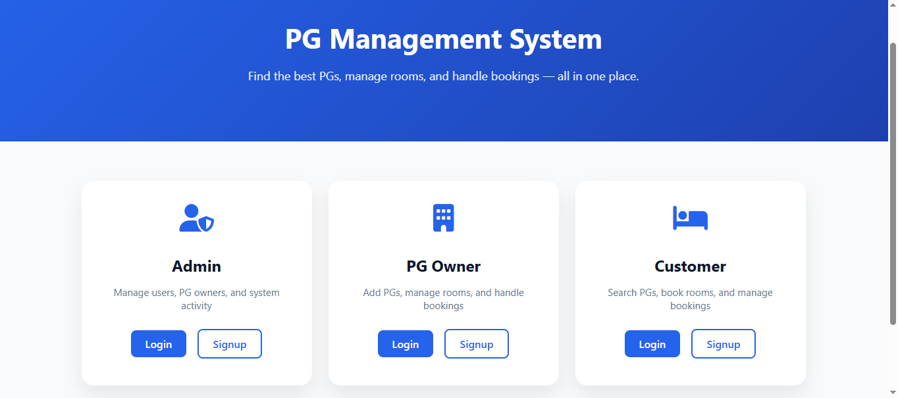
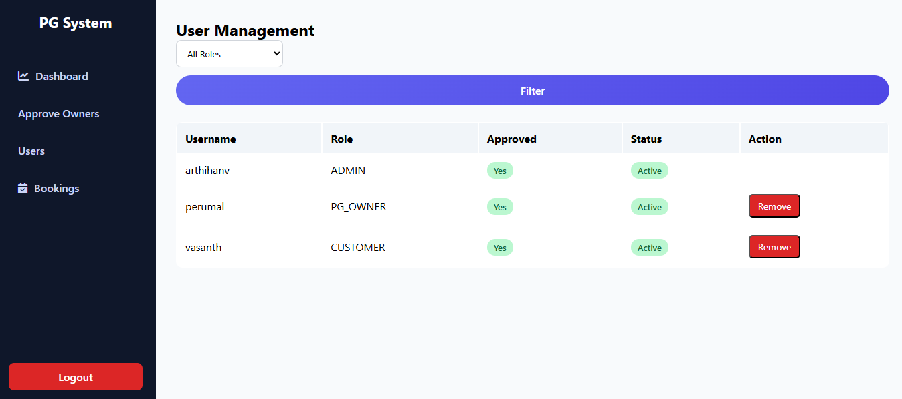
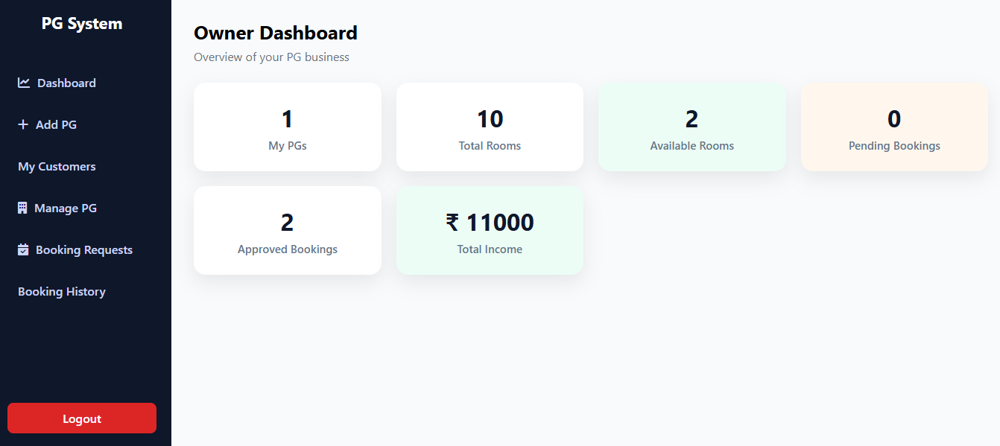
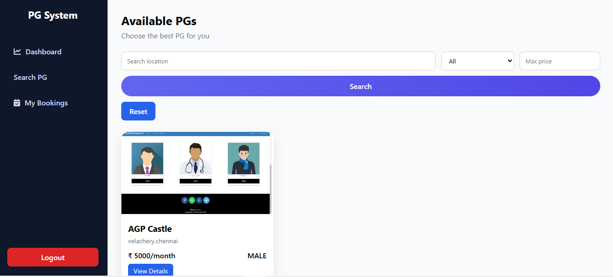

# PG Management System

A role-based PG Management System built using Django.

## Screenshots

### Index Page


### Admin Dashboard


### Owner Dashboard


### Customer Search

![Booking list] (screenshots/customer1.png)


## Features
- Admin, PG Owner, Customer roles
- PG & Room management
- Booking system with approval
- Dashboards with analytics
- Search & filter PGs
- Modern UI with fixed sidebar

## Tech Stack
- Django
- SQLite
- HTML, CSS, JavaScript

## How to Run
```bash
pip install -r requirements.txt
python manage.py migrate
python manage.py runserver
